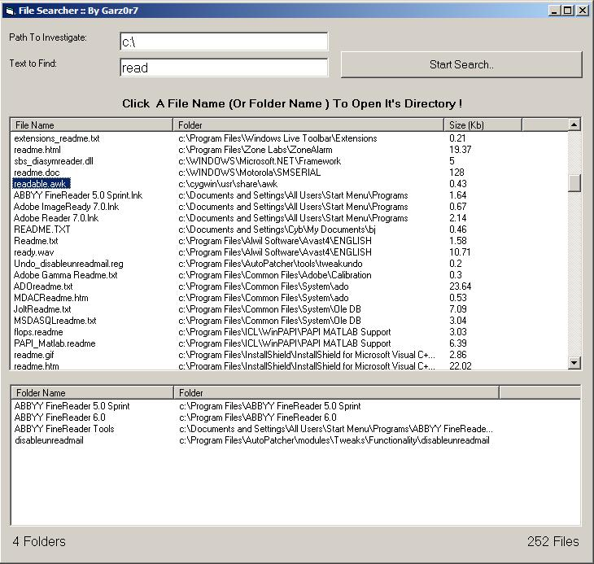



## File Searcher

### Description

It's a file searcher.Type a path and the name of the file you want to search and it will investigate all folders and sub folders of the path.It's simple and fast.NO API CALLS , NO MODULES just SIMPLE CODE.
 
### More Info
 

             |
---                |---
**Submitted On**   |2007-02-19 11:32:20
**By**             |[garz0r7](https://github.com/Planet-Source-Code/PSCIndex/blob/master/ByAuthor/garz0r7.md)
**Level**          |Beginner
**User Rating**    |4.7 (14 globes from 3 users)
**Compatibility**  |VB 6\.0
**Category**       |[Files/ File Controls/ Input/ Output](https://github.com/Planet-Source-Code/PSCIndex/blob/master/ByCategory/files-file-controls-input-output__1-3.md)
**World**          |[Visual Basic](https://github.com/Planet-Source-Code/PSCIndex/blob/master/ByWorld/visual-basic.md)
**Archive File**   |[File\_Searc2050372262007\.zip](https://github.com/Planet-Source-Code/garz0r7-file-searcher__1-67723/archive/master.zip)

